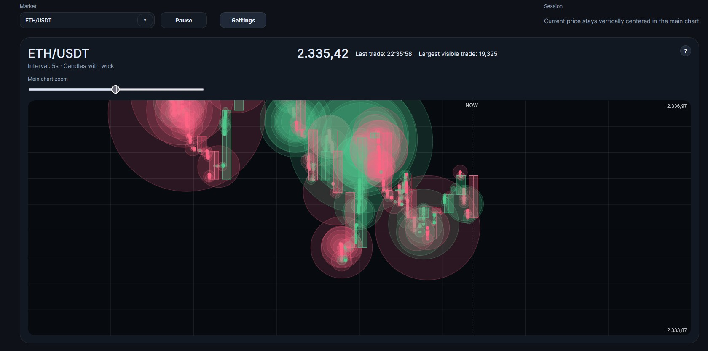
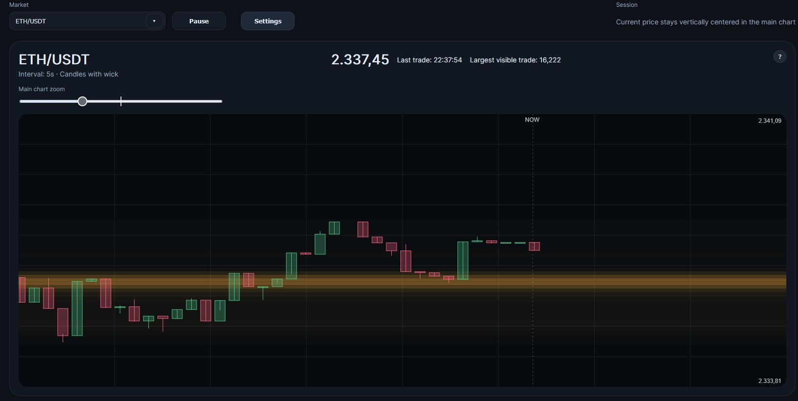
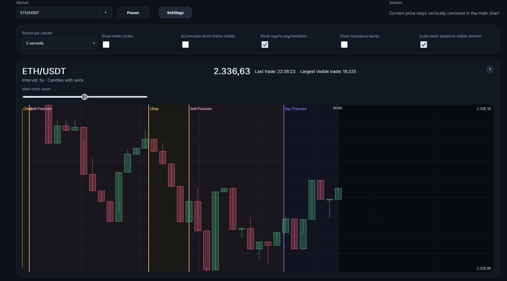
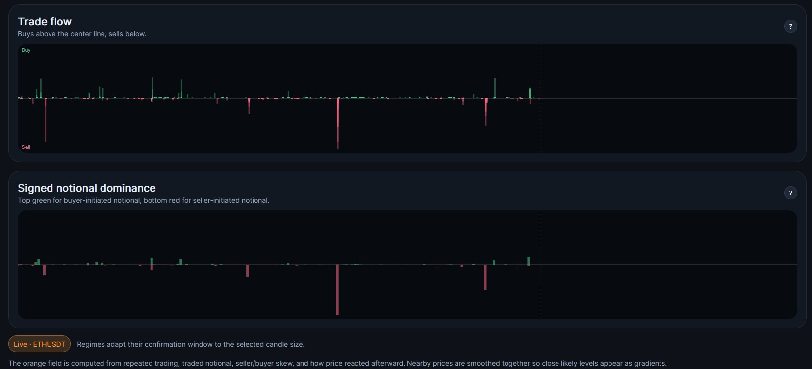

# Whale Tracker

<p align="center">
  
</p>

A local Binance spot-market dashboard for visual whale-style trade tracking.

It focuses on:
- live candlestick visualization
- large trade circles
- trade-flow bars
- signed notional dominance
- simple regime segmentation
- orange support/resistance likelihood lines based on executed trade activity

## Features

- Searchable market selector from Binance symbols
- Live trade stream over Binance WebSocket
- Candles with wick
- Main chart with trade circles sized by trade volume
- Lower trade-flow panel for buyer- vs seller-initiated trades
- Signed notional panel for money-weighted flow
- Regime overlays with simple, stable labels
- Orange executed-trade support/resistance likelihood overlay
- Pause, zoom, vertical pan, and reset orientation
- In-app tooltip help for each chart area

## Quick start

Clone the repo:

```bash
git clone https://github.com/felixgriebel/WhaleTracker_Dashboard.git
cd whale-tracker
```

Create and activate a Conda environment:

```bash
conda create -n whale-tracker python=3.11 -y
conda activate whale-tracker
```

Install dependencies:

```bash
pip install -r requirements.txt
```

Run the app:

```bash
python app.py
```

Open:

```text
http://127.0.0.1:5000
```

## Screenshots

After you add screenshots manually to the `resources/` folder, the images below will render automatically.

### Main chart — trade circles
Shows candles and whale circles, with circle size based on trade size.



### Main chart — orange support/resistance likelihood
Shows orange likelihood lines derived from repeated executed trading activity at nearby price levels.



### Main chart — regime overlay
Shows the simplified regime segmentation layer.



### Lower panels
Shows the trade-flow chart and the signed notional dominance chart.



## Project structure

```text
whale-tracker/
├── app.py
├── requirements.txt
├── README.md
├── resources/
│   ├── whale-logo.svg
│   ├── README.txt
│   ├── main-circles.png
│   ├── main-resistance.png
│   ├── main-regimes.png
│   └── lower-panels.png
├── static/
│   ├── app.js
│   └── styles.css
└── templates/
    └── index.html
```

## Notes on the current implementation

- The app uses Binance public spot-market data.
- Trade identity is anonymous in public Binance streams; you can see trade IDs and trade-side proxy fields, but not the user or wallet identity.
- The regime segmentation is intentionally simple and stability-first. It is a practical overlay, not a full academic microstructure model.
- The orange lines are based on executed-trade activity, not on full order-book liquidity.

## Credits and references

### Data source
- Binance Spot API and WebSocket streams

### Core libraries
- Flask
- Requests
- Vanilla JavaScript + HTML Canvas

### Concepts that influenced the design
- Executed-volume / volume-profile style level estimation
- Short-horizon order-flow imbalance ideas from market microstructure
- Trade clustering and whale-style tape reading concepts
